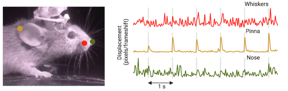

# DLC_sideview_tracking
This is a repo for a wrapper around a Res-Net-based algorithm (Mathis et al., 2018) for tracking the pinna, nose and whiskers of a mouse during e-phys recordings.


The steps described above can be run using each of the click functions from the main script:

# step 1: create-project 
this will open the deeplabcut GUI to manually label some frames

# step 2: train network 
this may take a while so run over night

# step 3: analyze videos 
will recursively search for h264 video files, exclude all files in --excluded, and create videos with markers if --create-videos is True

# step 4: repack
recursively convert deeplabcut (pandas hdf5) to numpy (npy) files

# step 5: compute 2D movement
uses x,y positions to compute 2D displacement per frame change

#Some extra functions are provided to compute a video's brightness and adjust the gamma value is it's outside a selected range


This should create a pupil data file (e.g., `rpi_camera_2_pupil_data.npy`) in each directory that contains a h264 video file recorded using a Raspberry PI camera (unless it was excluded when calling `analyze`). How to read the data:  
```
import numpy as np
data = np.load('rpi_camera_2_pupil_data.npy').item()
video_ts = data['timestamps']  # video time stamps aligned to the neural data (in seconds)
pupil_size_pix = data['pupil_size_pix']  # the length of the larger ellipse axis in pixels
```



Figure showing results from an example session where mouse was presented 
with noiseburst stimuli every 1 second. 

# Reference:
```
Mathis, A., Mamidanna, P., Cury, K.M. et al. DeepLabCut: markerless pose estimation of user-defined body parts with deep learning. Nat Neurosci 21, 1281–1289 (2018). https://doi.org/10.1038/s41593-018-0209-y
```

